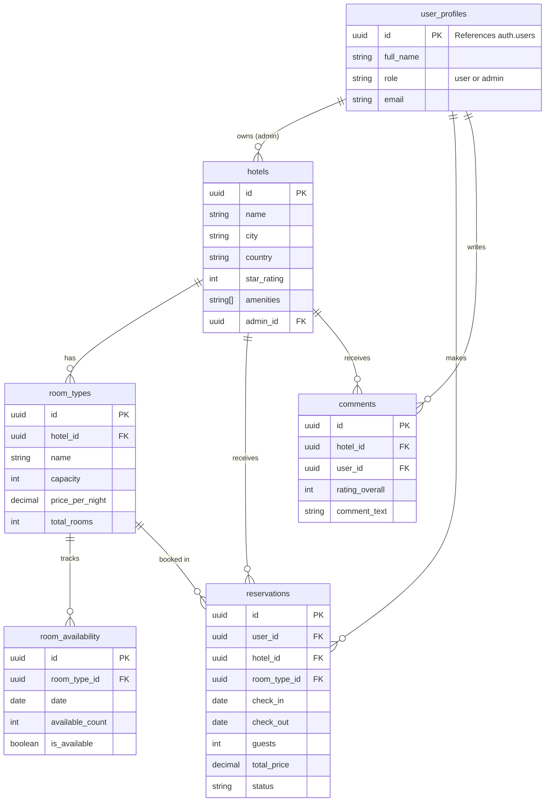

# Hotello - AI-Powered Hotel Booking System

Hotello is a modern, microservice-based hotel booking platform built for the SE4458 assignment. It features a stunning glassmorphism UI, secure authentication, role-based access control, distributed caching, an asynchronous notification queue, and an autonomous AI Agent that can search and book hotels for you.
<!--
## 🚀 Deliverables

- **Public GitHub Repository**: [Link to Repo](#) *(Replace with actual link)*
- **Deployed Application**: [https://hotello.vercel.app](#) *(Replace with actual link)*
- **Presentation Video**: [YouTube Link](#) *(Replace with actual link)*
---
-->

## 🏗️ Architecture & Design

Hotello is built using a decoupled architecture, orchestrated through a custom API Gateway.

### Tech Stack
* **Frontend**: React + Vite (Single Page Application)
* **API Gateway & Services**: Vercel Serverless Functions (Node.js)
* **Database & Auth**: Supabase (PostgreSQL + IAM)
* **Caching**: Redis Cloud (ioredis)
* **Message Queue**: CloudAMQP / RabbitMQ (amqplib)
* **Scheduling**: Azure Logic Apps
* **AI Engine**: Google Gemini (via `@google/genai`)

### Design Decisions & Assumptions
1. **API Gateway**: Instead of using Azure API Management (which is costly), a custom lightweight API Gateway was implemented using a Vercel catch-all serverless function (`api/v1/gateway/[...path].js`). It routes requests to the correct internal service and handles Authorization headers seamlessly.
2. **Atomic Bookings**: To prevent double-booking, the reservation logic is handled via a PostgreSQL RPC function (`book_room`) within Supabase. This guarantees ACID compliance by locking the row (`FOR UPDATE`) and deducting the capacity inside a single transaction.
3. **Caching Strategy**: Redis is used to cache Hotel Search results and Hotel Details. Because caching availability dynamically can lead to stale data during high concurrency, the cache is invalidated immediately upon a successful booking.
4. **Asynchronous Notifications**: When a user books a room, the system does not block the HTTP request to send an email. Instead, it publishes a message to RabbitMQ. An Azure Logic App periodically triggers the `process-queue` endpoint to pull messages and handle the heavy lifting.
5. **AI Agent**: The AI Agent is powered by Google's `gemini-2.5-flash` model. It is provided with specific "Tools" (Function Calling) that allow it to securely hit the internal `/search` and `/book` endpoints on behalf of the user.
6. **Assumptions**: 
   - A single hotel can have multiple "Room Types" (e.g., Standard, Suite), and availability is managed at the Room Type level per day, rather than managing individual physical room numbers.
   - Payments are out of scope (as per requirements); reservations are confirmed immediately upon booking.

### Known Issues & Future Improvements
- **Serverless Queue Processing**: While triggering the queue processor via Azure Logic Apps works, pulling from RabbitMQ inside a serverless function has execution time limits (e.g., 10 seconds on Vercel Hobby). In a high-scale production environment, a dedicated long-running worker (like an Azure WebJob or Docker container) would be more resilient.

---

## 🗄️ Data Models (ER Diagram)

The database is built on PostgreSQL via Supabase. Below is the Entity-Relationship representation:



---

## ⚙️ Local Setup

1. **Clone the repository**
2. **Install dependencies**: `npm install`
3. **Environment Variables**: Copy `.env.example` to `.env.local` and fill in the required keys (Supabase, Redis, RabbitMQ, Gemini).
4. **Run the development server**: 
   ```bash
   vercel dev
   ```
   *(Note: Use `vercel dev` instead of `npm run dev` to ensure the serverless functions in the `api/` directory are properly emulated locally alongside the Vite frontend).*
