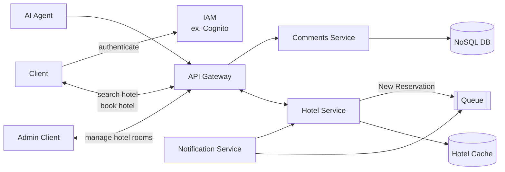

## Hotello - Hotel Booking System

Create a hotel booking system like Hotels.com. Implement Below are use cases for functional
and non-functional requirements.

## HOTEL ADMIN SERVICE

- Admins for hotels can add/update rooms for availability between start and end dates
- Image uploading is not necessary but nice-to-have
- THIS WILL BE AN AUTHENTICATED SERVICE

## HOTEL SEARCH SERVICE

- User can search hotels by destination point, dates and number of people. Only rooms that admins
    specified as vacant will appear in results for given dates
- Client who login to application will see 15% discounted prices.
- ‘Haritada goster’ is required to show hotels that have been searched

## BOOK HOTEL SERVICE

- On hotel detail page, user can book the hotel. Capacity of the hotel needs to be decreased
    for specified dates
- NO transaction needed for payment

## HOTEL COMMENTS SERVICE
- On clicking of comments, a graphs that shows distribution of comments per service will
    be shown along with comments and ratings


## NOTIFICATION SERVICE
- write a nightly scheduled task
  - to go over all hotel capacities and notify hotel administrators when it is below
       20% for the next month.
  - to pull new hotel reservations from the queue and send them a message about
       reservation details

## AI AGENT SERVICE

Implement AI agent chat window in main application screen that will use APIs you created to perform
search and booking use cases

```
User: I'd like to book a hotel in Rome from July 15 to July 18 for two adults.
AI: Great! Any preferences for hotel rating, price range, or amenities?
User: 4+ stars, breakfast, and a pool would be ideal.
AI: Got it! Here are a few options you might like 👇
```
```
🏨Hotel Roma Plaza
-  📍City Centre
- ⭐4.5 | 💰 $210/night
- ✅Free Wi-Fi, Breakfast, Pool
- ⚪Reserve Room
```

```
🏨Grand Hotel
- 📍 Monti
- ⭐4.3 | 💰 $250/night
- ✅ Free Wi-Fi, Breakfast, Pool
- Reserve Room
```
```
AI: Would you like to confirm your reservation at Hotel Roma Plaza from July 15–18 for 2 adults?
User: Yes, book it
```
## NON-FUNCTIONAL REQUIREMENTS




- Comments will be stored in a separate No SQL DB
- Hotel details will be stored in a separate distributed cache like Redis

# COMMON REQUIREMENTS

- Project can be built on any service-oriented framework as long as requirements are met.
- Simple UI implementation per mock-ups given above is required. Front end UIs do not
    have to be same as shown above. It just needs to work
- All business use cases above must be available via REST webservices
- The project will be deployed to providers like Azure, Google Cloud, Vercel and AWS or
    any other cloud vendor
- Per deployment diagrams above, Job Search, Hotel and Notification services will be
    deployed separately. All APIs will be reached via an API gateway
- You can use RabbitMQ or Azure Messaging for queue solutions.
- All REST services must be versionable and support pagination when needed
- You can choose any development environment you like as long as they support REST
    services and is deployable in cloud.
- For caching, you can user services like Redis or use in-memory-caching
- All user authentication will be stored in an IAM service like AWS Cognito, Firebase
    Authentication or Supabase Auth. No external authentication like Google needed. Your
    local authentication implementation will not be accepted
- For AI Agent, real time messaging IS NOT required
- You can make assumptions as long as you document them
- At least one distributed caching solution needs to be implemented i.e Hotel Details
- MAKE SURE TO CREATE A DOCKER FILE in your source. See an example at
    https://www.digitalocean.com/community/tutorials/how-to-build-a-node-js-application-
    with-docker for a node.js application. DO NOT CREATE A DOCKER IMAGE FILE, it
    would be too big and not needed
- DEPLOYMENT
    - create a data model for each data source and use a DATABASE service from any
       cloud service you like i.e Azure SQL Server, Azure Cosmos Table. SQLite is
       NOT allowed
    - For API and UI layer hosting of app services, use a cloud service i.e Azure App
       Services


```
- For API gateway, you can use the gateway you implemented in assignment.
Azure API management is costly so refrain from using it unless you want to pay
for it
- For queue service, use Azure Message Queues, Rabbit MQ
- For scheduling services, use a cloud service i.e Azure App Logic or
https://cloud.google.com/scheduler/
```
# DELIVERABLES

- Public Github repository link
- A README document in your GITHUB repository that has
    o Final deployed urls of the application
    o your design, assumptions, and issues you encountered.
    o Data models (i.e an ER)
    o Include a link to a short video (max 5 minutes) presenting your project.

---

# SERVICES THAT WILL BE USED
- Azure Logic Apps for scheduling
- Supabase for database and authentication
- Vercel for API and UI hosting
- Redis.io for caching
- RabbitMQ CloudAMQP for queue service
